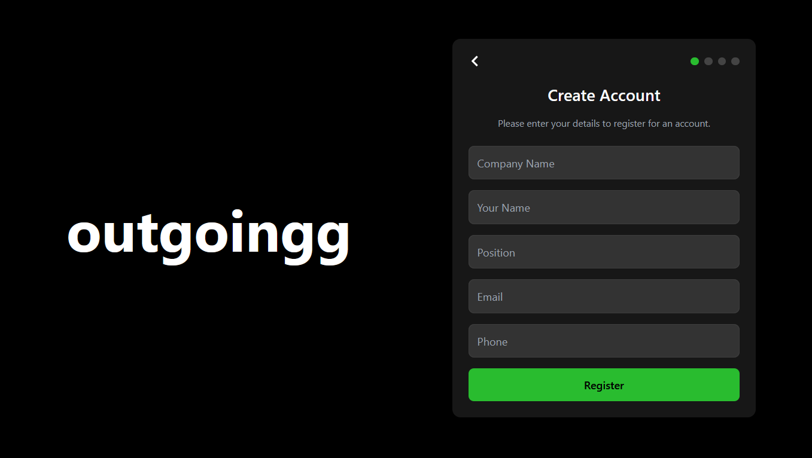
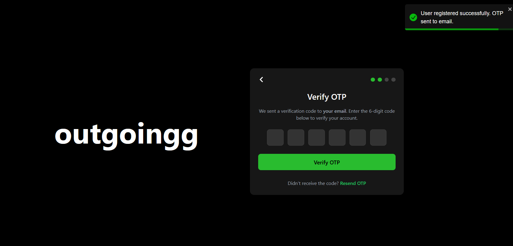
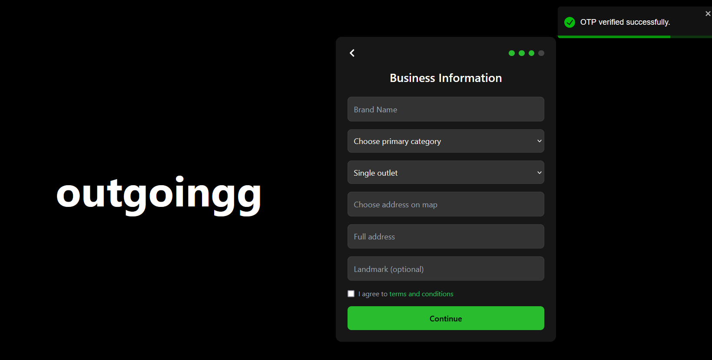

# Outgoingg - Business Registration and Management System

Outgoingg is a full-stack web application designed to streamline the business registration process. It incorporates OTP-based authentication, progressive form submission, session management, and user-specific navigation based on signup progress. The system ensures a secure and seamless registration experience with robust backend logic and a responsive frontend.

---

## Screenshots

Below are the screenshots of the project pages in sequential order:

### 1. Login Page


### 2. Register Page


### 3. OTP Verification Page


### 4. Submit Business Information Page


### 5. Submit Final Details Page


---

## Features

- **User Authentication:** Secure OTP-based email verification.
- **Progressive Form Submission:** Navigate through a structured registration process, filling out business information and uploading necessary documents.
- **Session Management:** Ensures users can resume the registration process from where they left off.
- **Validation and Error Handling:** Detailed validation and feedback for better user experience.
- **Responsive Design:** Optimized for all devices.

---

## Folder Structure and Role of Files

### Backend

```
backend
├── src/
│   ├── config/               # Configuration files
│   │   └── db.js             # MongoDB connection setup
│   ├── controllers/          # Business logic for routes
│   │   ├── authController.js         # Handles user authentication and OTP verification
│   │   ├── businessController.js     # Handles business-related data operations
│   ├── database/             # Database-specific logic
│   ├── middlewares/          # Middlewares for validation and session management
│   │   ├── auth.js                   # Validates user session and authentication
│   │   ├── signupFlow.js             # Ensures users follow the registration flow
│   ├── models/               # Database schemas
│   │   ├── User.js                   # Schema for user details
│   │   ├── VerifiedUser.js           # Schema for storing verified users
│   ├── routes/               # API endpoints
│   │   ├── authRoutes.js             # Authentication-related routes
│   │   ├── businessRoutes.js         # Business-related routes
│   ├── services/             # Utility services
│   │   ├── emailService.js           # Email sending logic for OTPs
│   │   ├── otpService.js             # OTP generation and validation logic
│   ├── utils/                # Utility functions (e.g., formatting)
├── app.js                    # Backend entry point
├── .env                      # Environment variables for secrets and configurations
```

#### File Roles (Backend)

- **`authController.js`**: Manages user authentication, registration, OTP generation, and verification.
- **`businessController.js`**: Handles business information submission, validation, and retrieval.
- **`auth.js` Middleware**: Protects routes by ensuring only authenticated users can access them.
- **`signupFlow.js` Middleware**: Checks the user's current registration step and restricts access to unauthorized pages.
- **`User.js` Schema**: Defines the structure of the user collection in MongoDB.
- **`VerifiedUser.js` Schema**: Stores users who have completed registration and are verified.
- **`emailService.js`**: Sends OTP emails using the configured email service.
- **`otpService.js`**: Generates, validates, and manages OTPs.

---

### Frontend

```
frontend
├── src/
│   ├── assets/               # Static assets such as images and styles
│   ├── components/           # React components for each page
│   │   ├── Login.jsx                  # Login form
│   │   ├── Register.jsx               # Registration form (page 1)
│   │   ├── VerifyOTP.jsx              # OTP verification form (page 2)
│   │   ├── SubmitBusinessInfo.jsx     # Business information form (page 3)
│   │   ├── SubmitFinalDetails.jsx     # Final document upload form (page 4)
│   │   ├── ProtectedRoute.jsx         # Restricts page access based on user progress
│   ├── contexts/             # Context API for global state management
│   │   ├── AuthContext.jsx            # Stores and manages user authentication state
│   ├── axiosConfig.js        # Centralized Axios instance for API calls
│   ├── App.jsx               # Main app component containing route definitions
```

#### File Roles (Frontend)

- **`App.jsx`**: Defines the application's routes and integrates the components.
- **`axiosConfig.js`**: Configures a centralized Axios instance with base URL and credentials.
- **`AuthContext.jsx`**: Manages user authentication globally using React Context API.
- **`ProtectedRoute.jsx`**: Ensures users cannot access pages beyond their current registration step.
- **`Login.jsx`**: Handles user login and session initialization.
- **`Register.jsx`**: Collects user details during registration.
- **`VerifyOTP.jsx`**: Manages OTP verification to proceed further in registration.
- **`SubmitBusinessInfo.jsx`**: Captures business information.
- **`SubmitFinalDetails.jsx`**: Collects final details such as PAN, GST, and bank information.

---

## Setup and Installation

### Prerequisites

- Node.js (v14 or later)
- MongoDB (local or cloud instance)

### Steps to Run

#### Backend

1. Navigate to the `backend` directory:
   ```bash
   cd backend
   ```

2. Install dependencies:
   ```bash
   npm install
   ```

3. Configure `.env` file:
   ```
   PORT=5000
   MONGO_URI=<your-mongodb-uri>
   JWT_SECRET=<your-jwt-secret>
   EMAIL_SERVICE=<your-email-service>
   EMAIL_USER=<your-email>
   EMAIL_PASS=<your-email-password>
   ```

4. Start the server:
   ```bash
   npm start
   ```

#### Frontend

1. Navigate to the `frontend` directory:
   ```bash
   cd frontend
   ```

2. Install dependencies:
   ```bash
   npm install
   ```

3. Start the development server:
   ```bash
   npm run dev
   ```

4. Open `http://localhost:5173` in your browser.

---

## API Documentation

### Authentication Routes

| Method | Endpoint         | Description                         |
|--------|------------------|-------------------------------------|
| POST   | `/auth/register` | Register a new user                 |
| POST   | `/auth/verify-otp` | Verify the OTP sent to the email   |
| GET    | `/auth/user-info` | Retrieve user session and progress |

### Business Routes

| Method | Endpoint                 | Description                       |
|--------|--------------------------|-----------------------------------|
| POST   | `/business/add-info`     | Submit business information       |
| POST   | `/business/submit-documents` | Submit final documents          |
| GET    | `/business/documents/info` | Fetch submitted document details |

---

## Troubleshooting

1. **CORS Errors:**
   - Ensure `Access-Control-Allow-Origin` includes your frontend URL.

2. **Session Not Persisting:**
   - Verify your backend is properly storing sessions (e.g., using `express-session`).

3. **Validation Errors:**
   - Check if all required fields are properly submitted in the API request.
